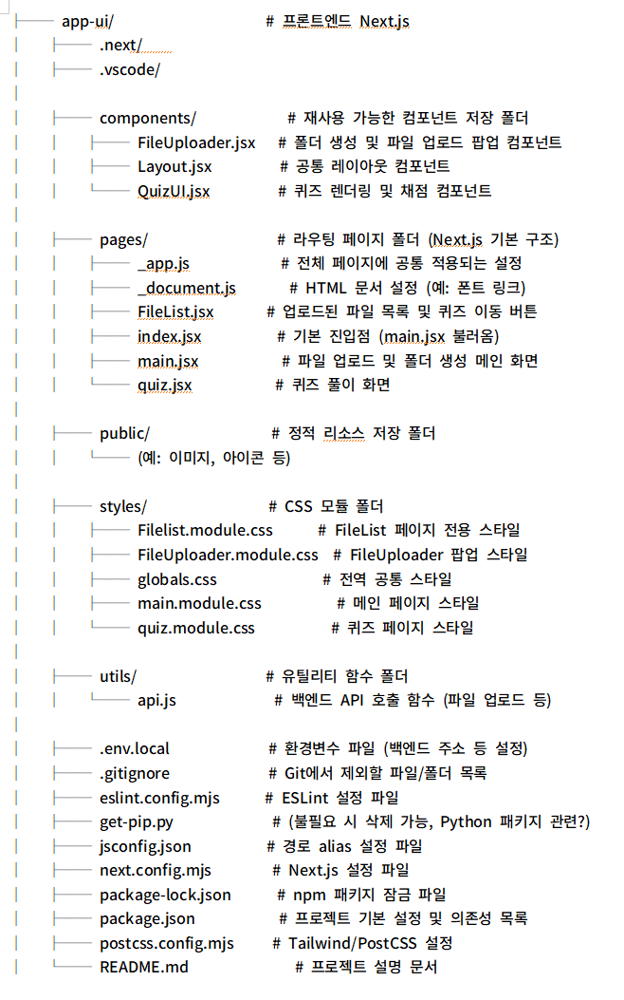
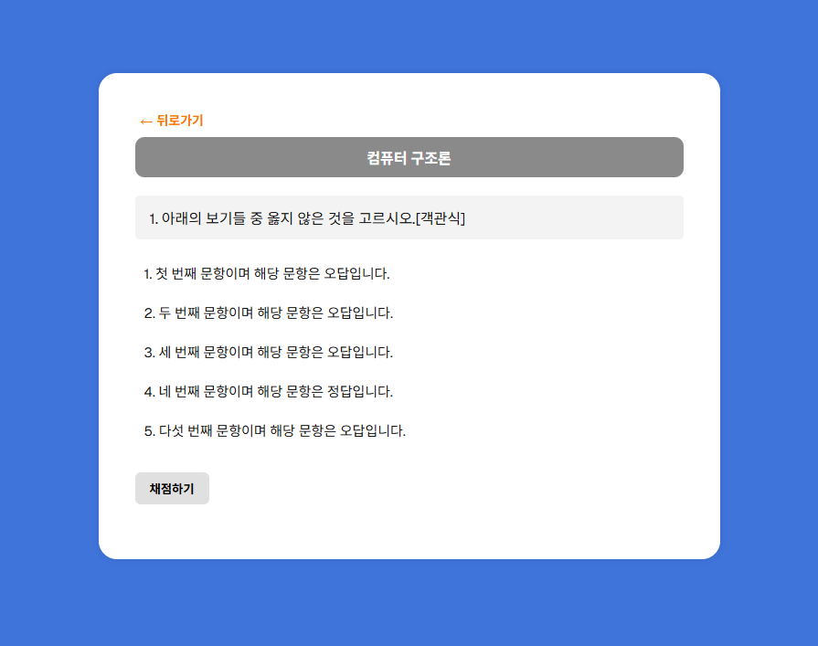
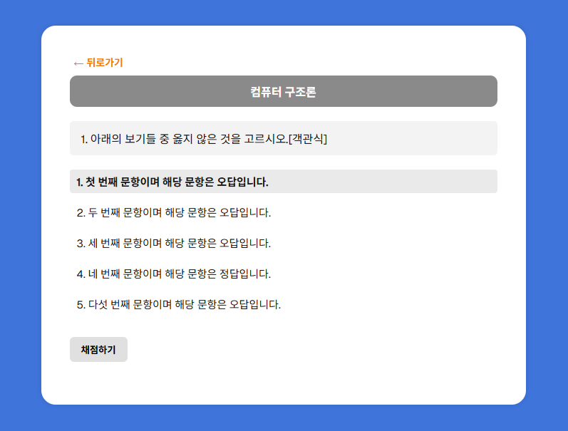
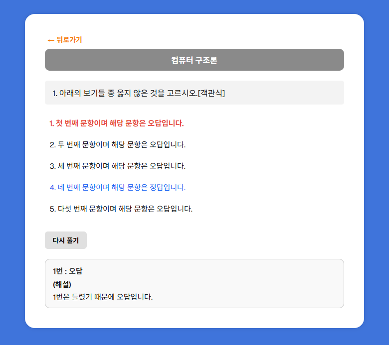
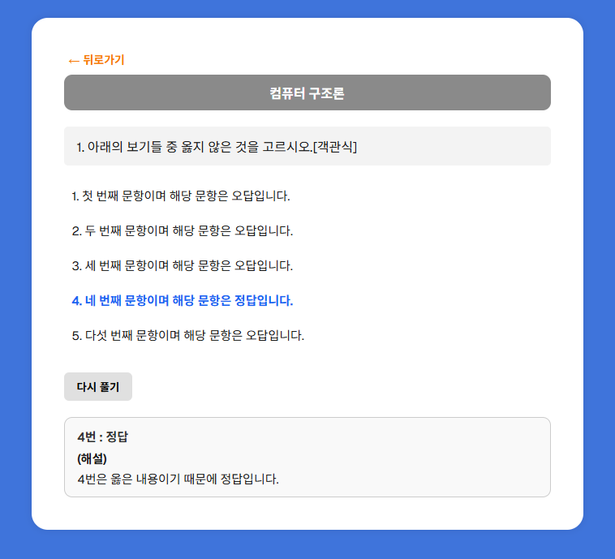

# UPUP_Project
팀 어푸어푸의 "러닝메이트 학습 웹앱 만들기 프로젝트"의 프론트 코드 레포지토리 입니다.

### 프론트 파일 구성

# [📁 프로젝트 폴더 구조: app-ui]
 </img> 

## 퀴즈생성 페이지 안내

- 6가지의 AI모델을 소개하고 간략한 설명과 어떤 상황에 사용하면 좋을지에 대한 정보를 제공합니다.
- 페이지를 구성하고 있는 AI의 종류는 아래와 같습니다.
    - GPT / wrtn / Claude / Gemini / Clova X / Perplexity
- "추가 설명"버튼을 통해 보다 상세한 모델의 정보를 확인하실 수 있습니다.
- "간단히 보기"버튼을 통해 설명을 간략화 할 수 있습니다.
- 각각의 설명 아래에 있는 "~구경하러 가기!"버튼을 통해 해당하는 AI 모델의 페이지로 이동합니다.

## 추가된 요소(25.05.11기준)

- QuizUI.jsx         # 퀴즈 렌더링 및 채점 컴포넌트
- quiz.jsx           # 퀴즈 풀이 화면
- quiz.module.css          # 퀴즈 페이지 스타일

## 추가된 기능(25.05.11기준)

- '뒤로가기' 버튼 클릭 시 직전 페이지로 이동
- '다시풀기' 버튼 클릭 시 해설 출력란이 사라지고 문항의 정/오답 표시 초기화

## 결과화면 출력

## 출력결과

<b>(렌더링 화면)</b>
 </img> 

<b>(문항 선택시 폰트 굵게)</b>
 </img> 

<b>(채점하기 클릭 - 오답 선택시)</b>
 </img> 

<b>(채점하기 클릭 - 정답 선택시)</b>
 </img> 
